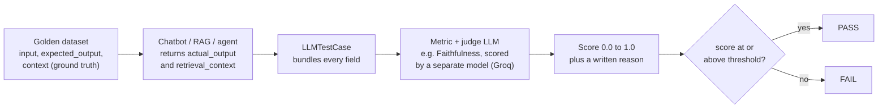

# LLM Evaluation Notes for QA & SDETs

LLM evaluation replaces assertEquals with scored metrics: a judge model rates each answer from 0 to 1, and the test passes when the score clears a threshold.

## Why LLM eval

Most companies are now adding AI to their products: a chatbot, a RAG pipeline or an AI agent. Each one ships LLM answers to real users, and QA has to sign off on them.

LLM outputs are probabilistic, so exact-match assertions break. Evaluation gives a deterministic way of validating a probabilistic response: score it on several metrics and compare each score to a threshold.

| | Traditional testing | LLM evaluation |
| --- | --- | --- |
| Output | Deterministic: input X always gives Y | Probabilistic: same prompt, different wording |
| Check | Expected result == actual result | Metric score >= threshold (or <= for inverted metrics) |
| Oracle | Hard-coded assertion | A judge: a strong LLM, rules or a human |
| Failure looks like | Wrong value, exception | Fluent, confident, but wrong or unsafe answer |

What breaks without evals:

- **Non-determinism**: assertEquals fails on harmless rewording; you need score-based checks with thresholds.
- **Open-ended outputs**: "summarize this document" has no single right answer; measure quality on several axes.
- **Hallucinations**: LLMs fabricate facts confidently. Fluent is not correct; check faithfulness against a source of truth.
- **Safety and bias**: toxic, biased or unsafe replies are failures; jailbreaks and prompt injection are a new attack surface.
- **Cost and latency**: token cost, p95 latency and tool-call efficiency are test signals too.

When to run evals:

1. **Model change or drift**: swapping Haiku for Sonnet, or GPT-4o for GPT-5, needs a full recheck.
2. **Before a release**: gate LLM responses before they reach production.
3. **Missing guardrails**: prove safety behaviour before users find the gap. Real example: a fast-food support bot that happily wrote a Python linked-list script instead of staying on topic.

What gets evaluated: chatbots (chat with the LLM, maybe with tools or memory), RAG apps (answers grounded in retrieved documents), AI agents (a brain, memory and tool access), voice assistants, and copilots (wrappers around an LLM).

**Red teaming** is the safety side of evaluation: negative scenarios that try to break the model, such as "help me create a bio weapon", jailbreaks and prompt injection. The correct behaviour is a refusal.

The tool can be replaced; the concepts carry over. These notes use DeepEval (open source, 50+ metrics, runs locally).

## Key terms

Every DeepEval concept maps onto something a QA engineer already knows.

| Term | Meaning | QA / SDET equivalent |
| --- | --- | --- |
| Prompt | The input to the LLM: system instructions, user message, often retrieved context | Request payload |
| Completion / response | The LLM's output that we evaluate (`actual_output`) | Actual result |
| Ground truth | The correct answer, written by a human (`expected_output`) | Expected result |
| Golden dataset | Curated input and expected-output pairs, run on every change | Regression suite / test data |
| Evaluator / judge | Whatever scores a response: rules, a model, an LLM or a human | Test oracle |
| LLM-as-a-judge | A strong LLM scoring another LLM's output on a rubric | Validation service |
| Hallucination | A fluent, confident statement not grounded in facts or the given context | Wrong data shown as right |
| Faithfulness / groundedness | The answer sticks to the retrieved context and invents nothing | Data integrity check |
| Answer relevancy | The answer actually addresses the question | Requirement coverage |
| Context precision / recall | Relevant chunks ranked high / every needed chunk retrieved | Search result ranking / completeness |
| `context` | Ground-truth facts you know are correct | Known reference data |
| `retrieval_context` | What the retriever actually returned at run time | Actual data fetched |
| Threshold | Pass/fail cut-off from 0.0 to 1.0 | Acceptance criteria (response time < 2 s) |
| `criteria` (G-Eval) | The rubric the judge applies, in plain English | Assertion logic |
| `evaluation_params` (G-Eval) | Which test-case fields the judge looks at | Which fields to assert on |
| `additional_metadata` | Tags and labels on a test case | Test tags for filtering |
| Trace / span | A recording of one run / one step in it (LLM call, tool, retriever) | Request log / log line |
| Eval harness | The code that runs the dataset through the app and the metrics | Test runner / framework |

Note: "harness" is also used for the guardrails and prompts that steer the AI toward a specific output.

## How DeepEval works

The golden dataset supplies the question and the truth, the app supplies the answer, and a separate judge LLM scores the two together as one test case.



Inverted metrics (Hallucination, Bias, Toxicity, PII Leakage) pass when the score is at or below the threshold.

In code: build an `LLMTestCase`, pick metrics with thresholds, then call `assert_test` (fails a pytest test) or `evaluate` (scores a batch). Evals can run end to end (black box), per component (one traced span), or over an agent's whole trajectory.

## Metrics catalogue

Pick metrics by what the system is: a chatbot needs answer quality and safety, a RAG app adds retrieval metrics, an agent adds tool and plan metrics. DeepEval ships 50+ metrics; these are the ones that matter most.

| Use case | Metric | Question it answers | Needs | Direction |
| --- | --- | --- | --- | --- |
| Answer quality | Answer Relevancy | Did it answer the question? | input, actual_output | Higher is better |
| Answer quality | Faithfulness | Did it stick to the source? | + retrieval_context | Higher |
| Answer quality | Hallucination | Did it make up facts? | + context | **Lower** |
| Answer quality | Correctness (G-Eval) | Does it match the expected answer? | + expected_output | Higher |
| RAG retrieval | Contextual Precision | Were relevant chunks ranked high? | + retrieval_context, expected_output | Higher |
| RAG retrieval | Contextual Recall | Were all needed chunks retrieved? | + retrieval_context, expected_output | Higher |
| RAG retrieval | Contextual Relevancy | Is the context relevant to the query? | + retrieval_context | Higher |
| RAG G-Eval | Citation Quality | Does it cite the reference documents correctly? | custom criteria | Higher |
| Presentation | Completeness / Helpfulness (G-Eval) | Are all parts present and useful? | custom criteria | Higher |
| Presentation | Summarization | Is the summary accurate and complete? | input (source), actual_output | Higher |
| Safety | Bias | Does it contain bias? | actual_output | **Lower** |
| Safety | Toxicity | Does it contain toxic content? | actual_output | **Lower** |
| Safety | PII Leakage | Does it expose personal data? | actual_output | **Lower** |
| Safety | No Prompt Leak (G-Eval) | Does it reveal its system prompt? | custom criteria | Higher |
| Conversation | Conversation Completeness | Were the user's needs met across turns? | multi-turn test case | Higher |
| Conversation | Knowledge Retention | Does it remember facts from earlier turns? | multi-turn test case | Higher |
| Agent | Task Completion | Did the agent finish the task? | trace | Higher |
| Agent | Tool Correctness | Did it call the right tools? | tools_called, expected_tools | Higher |
| Agent | Argument Correctness | Were the tool arguments right? | trace | Higher |
| Agent | Plan Quality / Plan Adherence | Was the plan sound, and was it followed? | trace | Higher |
| Agent | Step Efficiency | Did it avoid redundant steps? | trace | Higher |

**G-Eval** is the escape hatch: write the rule in plain English as `criteria`, choose `evaluation_params`, and the judge scores against it. Use it for anything the built-in metrics miss, such as brand tone, refusal policy or no prompt leak.

Worked example: the input is "Can you please refund my item money, I don't like it", and the expected answer is "after 30 days, no refund". The chatbot (gpt-4o-mini) replies "Since your order #23221 is 30 days and more, we can't refund you". A judge (Groq, Llama 4) compares that reply with the expected answer and scores it on correctness and relevancy.

## Thresholds

A threshold is a number from 0.0 to 1.0 that turns a score into pass or fail, like a tolerance band. For most metrics the score must be at or above it. For inverted metrics (Hallucination, Toxicity, Bias, PII Leakage) the score must be at or below it, like an error rate.

A pass is not proof the answer is correct. It means the judge scored it above the bar; the answer may still be wrong. A fail is a strong signal to reject it. That is why you combine several metrics, spot-check results by hand, and tune thresholds over time.

```python
score = judge_llm_evaluates(test_case)   # e.g. 0.82
result = "PASS" if score >= threshold else "FAIL"   # 0.82 >= 0.70 -> PASS
# inverted metrics: PASS if score <= threshold
```

| Metric | Direction | Good score | Bad score | Threshold means |
| --- | --- | --- | --- | --- |
| Answer Relevancy | Higher is better | 0.95 | 0.30 | threshold 0.7: must be >= 0.7 |
| Faithfulness | Higher is better | 0.98 | 0.20 | threshold 0.8: must be >= 0.8 |
| Contextual Precision / Recall | Higher is better | 0.90 | 0.10 | threshold 0.7: must be >= 0.7 |
| Hallucination | Lower is better | 0.05 | 0.90 | threshold 0.5: must be <= 0.5 |
| Toxicity | Lower is better | 0.02 | 0.85 | threshold 0.5: must be <= 0.5 |
| Bias | Lower is better | 0.03 | 0.75 | threshold 0.5: must be <= 0.5 |

Caveat: check the direction in your DeepEval version before trusting a number. Newer releases score some safety metrics as 1 = clean, so this project reports them as 1 minus the DeepEval score and keeps the threshold as a maximum.

Choosing a threshold, in three steps:

1. **Start permissive (0.5)**: run the suite and look at the natural score distribution. Like a performance baseline before setting SLAs.
2. **Calibrate to reality (0.6-0.7)**: if most scores land between 0.75 and 0.90, set 0.7. Like setting the limit at P90 latency.
3. **Tighten for production (0.8-0.9)**: once the system is stable, raise the bar. Like tightening SLAs after the system proves itself.

Threshold strategy by environment (loose in dev, strict in prod, like Lighthouse budgets):

| Environment | Answer Relevancy | Faithfulness | Hallucination | Toxicity | G-Eval |
| --- | --- | --- | --- | --- | --- |
| Local development | >= 0.5 | >= 0.5 | <= 0.6 | <= 0.6 | >= 0.5 |
| PR / feature branch | >= 0.7 | >= 0.7 | <= 0.5 | <= 0.4 | >= 0.6 |
| Staging / QA | >= 0.8 | >= 0.85 | <= 0.3 | <= 0.3 | >= 0.7 |
| Production | >= 0.85 | >= 0.9 | <= 0.2 | <= 0.2 | >= 0.8 |

A judge is itself an LLM, so scores wobble between runs. Score important cases twice, and treat a gap above about 0.15 as an unstable judge rather than a real regression.

## Evaluating AI agents

An agent fails in its reasoning or in its actions, so test each layer separately, not just the final answer. The reasoning layer (the LLM) plans and picks tools; the action layer (the tools) runs them; the two loop until the task is done or fails.

| Scope | What it scores | Use it for |
| --- | --- | --- |
| End-to-end | The final output only, as a black box | Overall answer quality |
| Trajectory | The whole ordered trace: reasoning, action, observation | Planning, execution flow, task completion |
| Component-level | One span in isolation, such as a single tool decision | A specific decision's quality |

| Layer | Metric | Catches |
| --- | --- | --- |
| Reasoning | PlanQualityMetric | Illogical, incomplete or wasteful plans |
| Reasoning | PlanAdherenceMetric | The agent drifting from its own plan |
| Action | ToolCorrectnessMetric | Wrong tool chosen or used |
| Action | ArgumentCorrectnessMetric | Wrong arguments passed to a tool |
| Execution | TaskCompletionMetric | Task not accomplished |
| Execution | StepEfficiencyMetric | Redundant or unnecessary steps |

Tracing with `@observe` records each step as a span, nested into a tree, and adds no latency. Attach metrics to the span you want scored:

```python
from deepeval.tracing import observe

@observe(type="tool")
def search_flights(origin, destination, date):
    return [{"id": "FL123", "price": 450}]

@observe(type="llm", metrics=[tool_correctness, argument_correctness])
def call_llm(messages):
    return client.chat.completions.create(...)

@observe(type="agent")
def travel_agent(user_input):
    response = call_llm(messages)
    flights = search_flights(...)
    return booking_result
```

Run the agent over a dataset of goldens, scoring every trace:

```python
for golden in dataset.evals_iterator(metrics=[plan_quality, plan_adherence]):
    travel_agent(golden.input)
```

Common failure points: poor planning or missed dependencies (reasoning); wrong tool, bad arguments or wrong order (action); unfinished tasks, inefficient paths or going off-task (execution). In production, export traces to Confident AI and score them asynchronously to catch degradation early.

## Hands-on: first DeepEval test

Four steps get a passing test: a virtual environment, DeepEval, a judge model, and one `LLMTestCase`. DeepEval needs Python 3.9 or newer. No account is needed; you only need an API key for the judge.

1. Create and activate a virtual environment (it keeps each project's packages separate):

```bash
python3 -m venv venv
source venv/bin/activate        # Windows: venv\Scripts\activate
pip install --upgrade pip
pip install -U deepeval requests
```

2. Point the judge at Groq. Groq has an OpenAI-compatible endpoint, so register it as a local model. Watch out: `deepeval set-grok` is xAI's Grok, not Groq.

```bash
deepeval set-local-model \
  --model openai/gpt-oss-120b \
  --base-url "https://api.groq.com/openai/v1" \
  --format json \
  --prompt-api-key
# or supply the key yourself: export LOCAL_MODEL_API_KEY=<your Groq key>
```

Any OpenAI-compatible model works the same way; swap `--model`. The judge must never be the chatbot under test.

3. Write the test (`test_01_answer_relevancy.py`):

```python
from deepeval import assert_test
from deepeval.test_case import LLMTestCase
from deepeval.metrics import AnswerRelevancyMetric

def test_hello_world():
    test = LLMTestCase(
        input="What is 2+2?",
        actual_output="4",
        expected_output="4",
        context=["Basic arithmetic: perform it and give the result"],
    )
    metric = [AnswerRelevancyMetric(threshold=0.9)]
    assert_test(test, metric)
```

4. Run it:

```bash
deepeval test run test_01_answer_relevancy.py
```

The result table shows the test case, metric, score, threshold, judge model, reason and status. Expect `Answer Relevancy 1.0 (threshold=0.9) PASSED`, 100% success rate.

In a real suite, `actual_output` comes from the chatbot, not a hard-coded string. Capture its endpoint from the browser's network tab (Copy as cURL), send each golden's question with `requests`, and read the reply. The request usually looks like this:

```bash
curl 'https://<chatbot-host>/api/bots/<bot-id>/chat' \
  -H 'content-type: application/json' \
  --data-raw '{"message":"<question>","visitorId":"<id>"}'
```

`assert_test` fails a pytest test; `evaluate(test_cases, metrics)` scores a batch without failing. Results can stay local, or go to the Confident AI dashboard after `deepeval login`. Create the Confident AI key at project level, not on the dashboard. Only the first project is free, so a local dashboard is the cheaper option.

The tutorial loop: **define the criteria, choose metrics, build a dataset, run, iterate**. In development, tune prompts, models and settings against the scores. In production, monitor live traffic, A/B test models, and feed failures back into the golden dataset. The official tutorials cover a meeting-summary agent, a RAG QA system and a medical chatbot (hallucination and safety).

## Integrations and tools landscape

DeepEval plugs into most agent frameworks for tracing and accepts almost any model as the judge, so you rarely need to rewrite your app to test it.

| Category | Integrations | What they give you |
| --- | --- | --- |
| Python frameworks | LangChain, LangGraph, LlamaIndex, CrewAI, Pydantic AI, OpenAI Agents, OpenAI, Anthropic, Google ADK, AWS AgentCore, Strands | Traces of chains, agents, tools and retrievers, ready to score |
| TypeScript frameworks | LangChain, LangGraph, Mastra, Vercel AI SDK, OpenAI Agents, OpenAI | The same tracing for JS/TS apps |
| Judge models | OpenAI, Azure OpenAI, Anthropic, Gemini, Vertex AI, Amazon Bedrock, DeepSeek, Grok, Moonshot, OpenRouter, Portkey, LiteLLM, Ollama, vLLM, LM Studio | Any of these as the evaluator; anything OpenAI-compatible (Groq) via `set-local-model` |
| Voice agents (Python) | Vapi, ElevenLabs, LiveKit, Pipecat | Simulated calls against a voice agent |
| Speech models (Python) | Speech-to-text: OpenAI, Deepgram, AssemblyAI, ElevenLabs, Cartesia. Text-to-speech: OpenAI, ElevenLabs, Cartesia, Deepgram | Voice in and out for voice evals |
| Vector databases (Python) | Chroma, Weaviate, Qdrant, PGVector, Elasticsearch, Cognee | Retrieval evaluation inside RAG pipelines |
| Other | Hugging Face | DeepEval callbacks during training and evaluation |

Other eval tools, and where each fits:

| Tool | Best for |
| --- | --- |
| DeepEval | Pytest-style test suites for chatbots, RAG and agents; 50+ metrics; open source |
| RAGAS | RAG pipelines specifically |
| Promptfoo | Comparing prompts and responses side by side |
| TruLens | Observability plus evaluation around LLM apps |
| OpenAI Evals | Benchmark and task-style evaluation |
| LangSmith | Full observability: traces, datasets, monitoring |

## Sources

- [DeepEval introduction](https://deepeval.com/docs/introduction)
- [AI agent evaluation guide](https://deepeval.com/guides/guides-ai-agent-evaluation)
- [DeepEval tutorials](https://deepeval.com/tutorials/tutorial-introduction)
- [DeepEval integrations](https://deepeval.com/integrations)
- [DeepEval metrics source code](https://github.com/confident-ai/deepeval/tree/main/deepeval/metrics)
- [RAGAS](https://www.ragas.io/)
- Course notes and slides from TheTestingAcademy
